# ScoutIQ-Football-Intelligence-Match-Prediction-Platform
<div align="center">


<a href="https://git.io/typing-svg">
  
</a>

<br />


<br />
<br />

<h3>⚽ A professional football intelligence platform that transforms FIFA-style match data into scouting insights, team comparisons, and machine-learning powered win probability predictions.</h3>

<p>
  <b>ScoutIQ</b> is built as a portfolio-grade data science project covering the full lifecycle:
  raw data understanding, cleaning, advanced EDA, domain feature engineering, multi-model benchmarking,
  hyperparameter tuning, model explainability, Flask deployment, and REST API integration.
</p>

</div>

---

## 📌 Table of Contents

- [Project Summary](#-project-summary)
- [Business Problem](#-business-problem)
- [Live Product Experience](#-live-product-experience)
- [Key Highlights](#-key-highlights)
- [Notebook Visual Showcase](#-notebook-visual-showcase)
- [Dataset Overview](#-dataset-overview)
- [End-to-End Workflow](#-end-to-end-workflow)
- [Data Cleaning Strategy](#-data-cleaning-strategy)
- [Feature Engineering](#-feature-engineering)
- [Exploratory Data Analysis](#-exploratory-data-analysis)
- [Machine Learning Pipeline](#-machine-learning-pipeline)
- [Model Results](#-model-results)
- [Application Architecture](#-application-architecture)
- [Flask Pages](#-flask-pages)
- [REST API Documentation](#-rest-api-documentation)
- [Project Structure](#-project-structure)
- [Installation Guide](#-installation-guide)
- [How to Run Notebooks](#-how-to-run-notebooks)
- [Deployment Guide](#-deployment-guide)
- [Reproducibility](#-reproducibility)
- [Future Improvements](#-future-improvements)
- [Author](#-author)

---

## 🚀 Project Summary

**ScoutIQ** is an end-to-end football analytics and match prediction system designed for football analysts, scouts, data science recruiters, and sports intelligence teams. The platform uses structured international football team data to evaluate performance, compare teams, and estimate match-winning probability using machine learning.

The project is not only a notebook experiment. It is converted into a usable **Flask web application** with dashboard pages, model insights, API endpoints, team explorer, and a prediction interface.

### What this project demonstrates

| Area | What is implemented |
|---|---|
| Data Science | Data audit, cleaning, EDA, statistical analysis, feature engineering |
| Machine Learning | Binary classification, cross-validation, model comparison, tuning, evaluation |
| MLOps Foundation | Saved model artefacts, reusable prediction pipeline, metadata tracking |
| Software Engineering | Modular `src/` package, Flask routes, REST APIs, production server setup |
| Product Thinking | User-facing dashboard, explorer, comparison page, predictor, model intelligence page |
| Portfolio Quality | Clean folder structure, documented workflow, deployment-ready configuration |

---

## 🎯 Business Problem

Football teams, scouts, analysts, and sports media teams often need fast answers to questions like:

- Which team has stronger recent form?
- How do FIFA rank, market value, squad experience, and tactical metrics affect winning probability?
- Which teams look undervalued compared with their performance indicators?
- Can historical performance indicators estimate whether a team is likely to win?
- Which model is reliable enough to support a football intelligence dashboard?

ScoutIQ solves this by converting raw match and team-level indicators into a **win probability intelligence layer**.

### Primary ML objective

> Predict whether a football team is likely to win a match using ranking, performance, attacking, defensive, squad value, tactical, and environmental features.

### Target variable

| Target | Type | Meaning |
|---|---:|---|
| `winner` | Binary classification | `1 = win`, `0 = non-win / loss-draw style outcome` |

### Prediction output

The deployed model returns:

- Win probability
- Loss probability
- Verdict label
- Confidence level
- Visual color category for UI rendering

---

## 🖥️ Live Product Experience

ScoutIQ is designed like a football intelligence SaaS product, not just a static notebook.

| Page | Route | Purpose |
|---|---|---|
| Home | `/` | Premium landing page with project positioning and summary |
| Dashboard | `/dashboard` | Executive KPIs, football analytics summaries, team insights |
| Team Explorer | `/explorer` | Searchable and filterable team database |
| ML Predictor | `/predict` | User input form for match win probability prediction |
| Team Compare | `/compare` | Compare two teams side-by-side using performance metrics |
| Model Intelligence | `/model-insights` | Model metrics, comparison table, metadata, explainability narrative |
| About | `/about` | Project story, pipeline explanation, and data science lifecycle |

---

## ✨ Key Highlights

- ✅ **1,000 training rows** and **250 test rows** from FIFA-style football match data
- ✅ **26 raw columns** in the training dataset
- ✅ **45 processed columns** after cleaning, encoding, and feature engineering
- ✅ **40 model-ready features** used by the final ML pipeline
- ✅ **10 domain-inspired engineered features**
- ✅ **6 ML models benchmarked** using cross-validation and training diagnostics
- ✅ **Best persisted model:** Logistic Regression
- ✅ **Best CV ROC-AUC:** `0.7161`
- ✅ **Train ROC-AUC:** `0.7391`
- ✅ **Train Accuracy:** `0.6680`
- ✅ **Train F1-score:** `0.6376`
- ✅ **Reusable prediction pipeline** with saved `best_model.pkl`
- ✅ **REST APIs** for dashboard, explorer, prediction, and comparison
- ✅ **Deployment-ready** with `Procfile`, `runtime.txt`, `gunicorn`, and `requirements.txt`

---


## 📸 Notebook Visual Showcase

> **All visuals below are exported directly from the project notebooks** so the repository feels more credible, analytical, and presentation-ready on GitHub.

### 1) Data Understanding & Cleaning Visuals

<table>
<tr>
<td width="50%" align="center">
  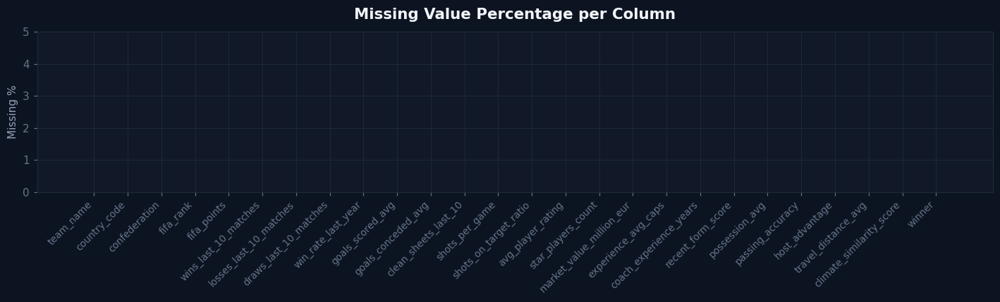<br/>
  <sub><b>Missing Value Audit</b> — column-wise completeness review used in the cleaning phase.</sub>
</td>
<td width="50%" align="center">
  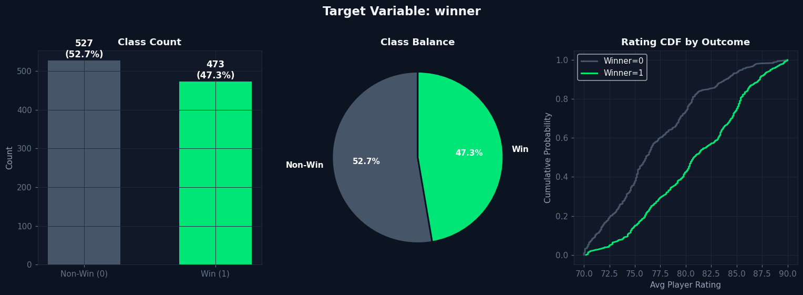<br/>
  <sub><b>Target Distribution</b> — class balance and cumulative perspective for the <code>winner</code> target.</sub>
</td>
</tr>
<tr>
<td colspan="2" align="center">
  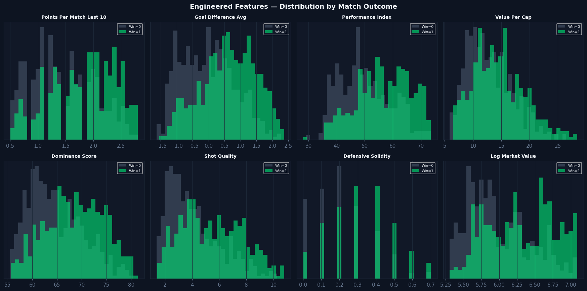<br/>
  <sub><b>Engineered Feature Review</b> — distribution patterns of newly created football intelligence features.</sub>
</td>
</tr>
</table>

### 2) Advanced EDA & Football Intelligence Visuals

<table>
<tr>
<td width="50%" align="center">
  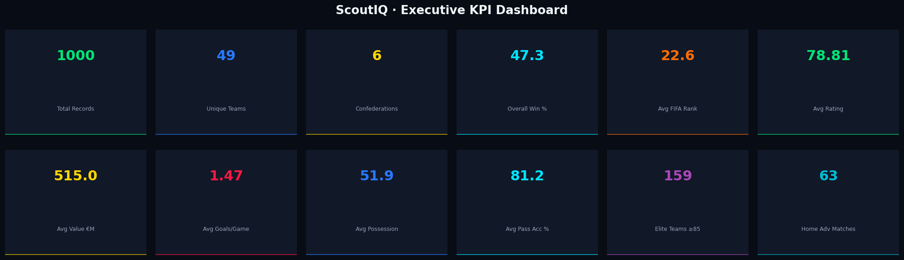<br/>
  <sub><b>Executive KPI Board</b> — high-level project summary including records, teams, confederations, and quality indicators.</sub>
</td>
<td width="50%" align="center">
  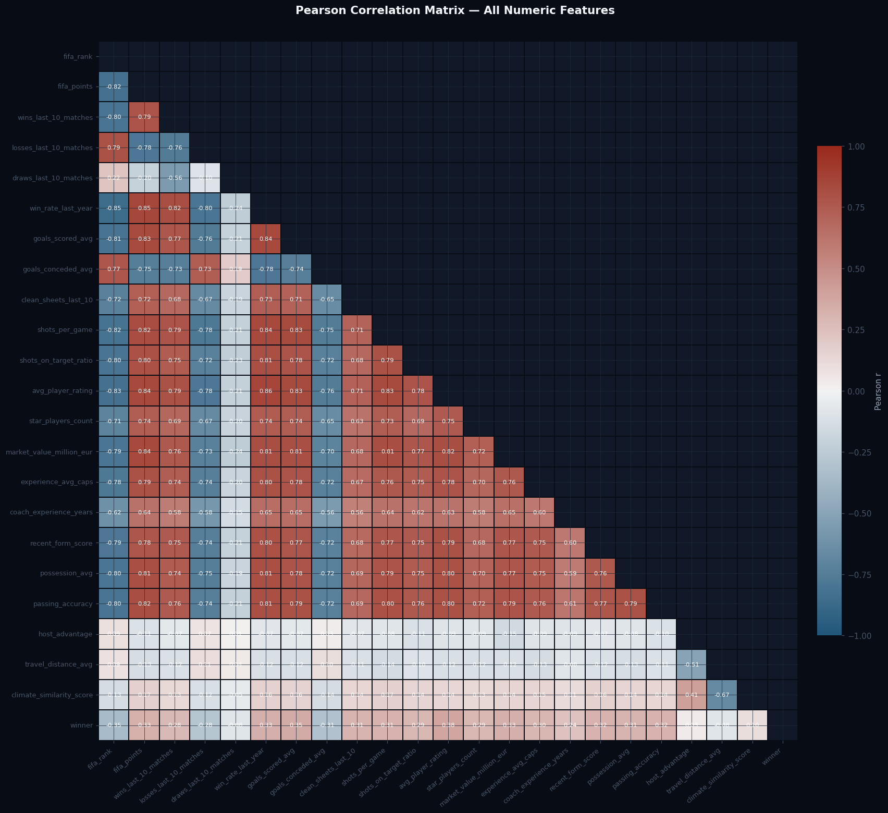<br/>
  <sub><b>Correlation Heatmap</b> — relationships across numeric football features and the target.</sub>
</td>
</tr>
<tr>
<td width="50%" align="center">
  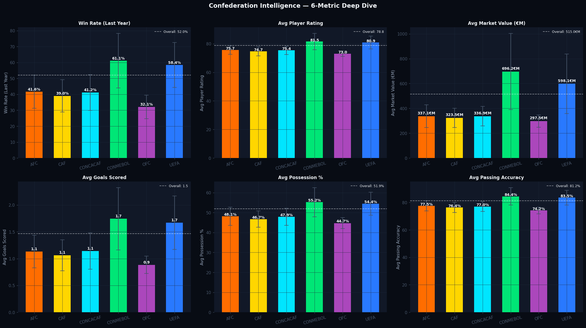<br/>
  <sub><b>Confederation Dashboard</b> — compares performance, value, and tactical indicators across confederations.</sub>
</td>
<td width="50%" align="center">
  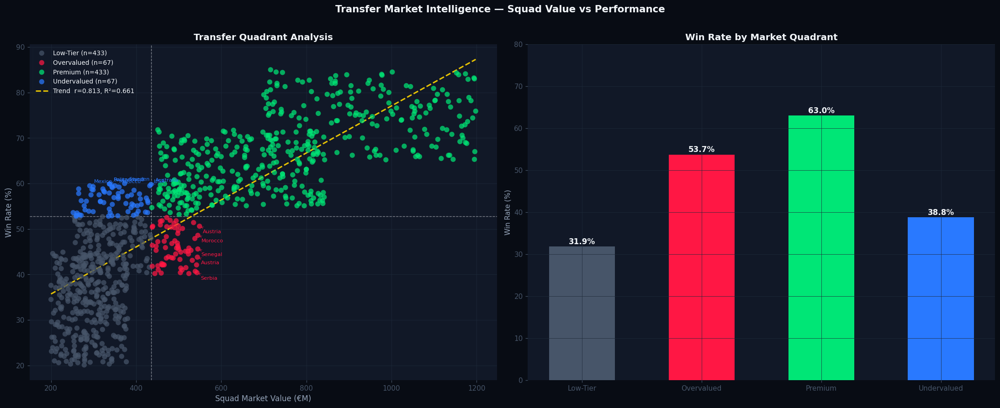<br/>
  <sub><b>Quadrant Analysis</b> — maps teams by market value and recent win profile to reveal hidden opportunities.</sub>
</td>
</tr>
<tr>
<td colspan="2" align="center">
  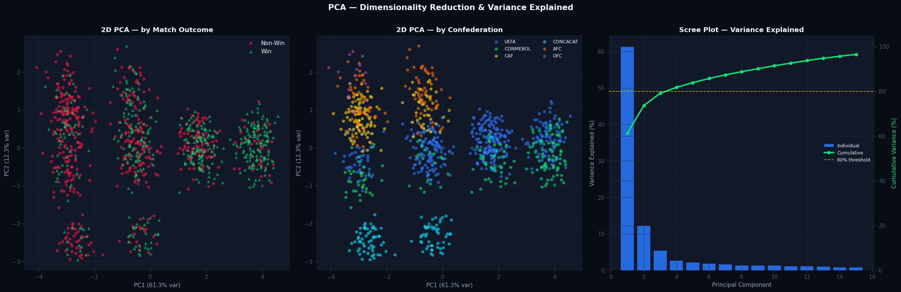<br/>
  <sub><b>PCA Visualisation</b> — dimensionality reduction view to inspect structure, separability, and latent clusters.</sub>
</td>
</tr>
</table>

### 3) Model Development & Evaluation Visuals

<table>
<tr>
<td width="50%" align="center">
  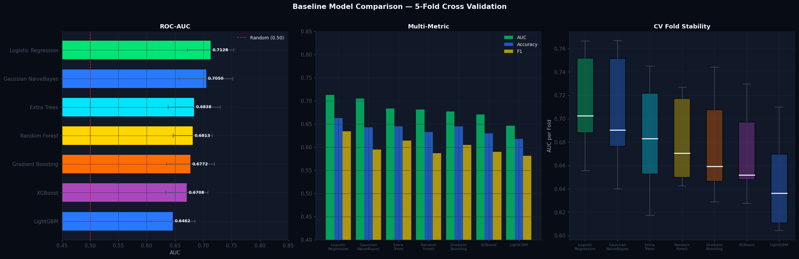<br/>
  <sub><b>Baseline Benchmarking</b> — first-pass comparison of classical machine learning models using cross-validation.</sub>
</td>
<td width="50%" align="center">
  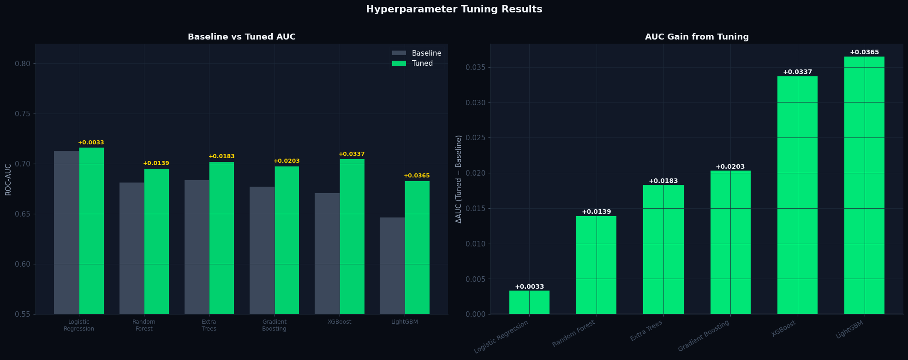<br/>
  <sub><b>Tuning Results</b> — improvement comparison before and after hyperparameter optimisation.</sub>
</td>
</tr>
<tr>
<td width="50%" align="center">
  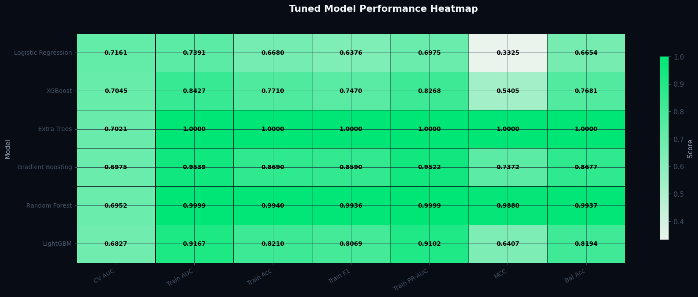<br/>
  <sub><b>Performance Heatmap</b> — compact leaderboard across AUC, F1, MCC, Brier, and other metrics.</sub>
</td>
<td width="50%" align="center">
  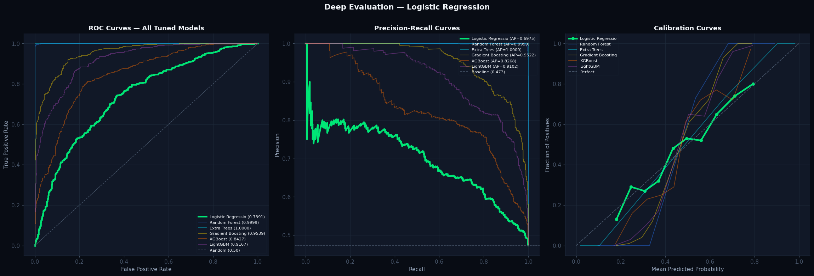<br/>
  <sub><b>ROC + PR + Calibration</b> — evaluates ranking ability, precision-recall behaviour, and probability calibration.</sub>
</td>
</tr>
<tr>
<td width="50%" align="center">
  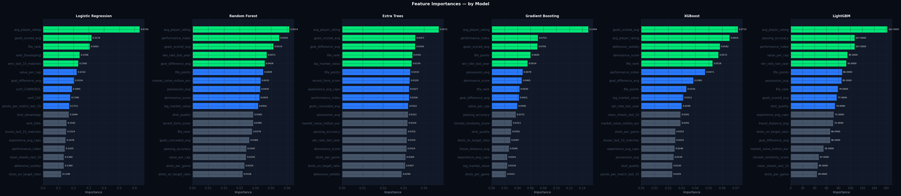<br/>
  <sub><b>Feature Importance</b> — ranked drivers of match outcome across tree-based models.</sub>
</td>
<td width="50%" align="center">
  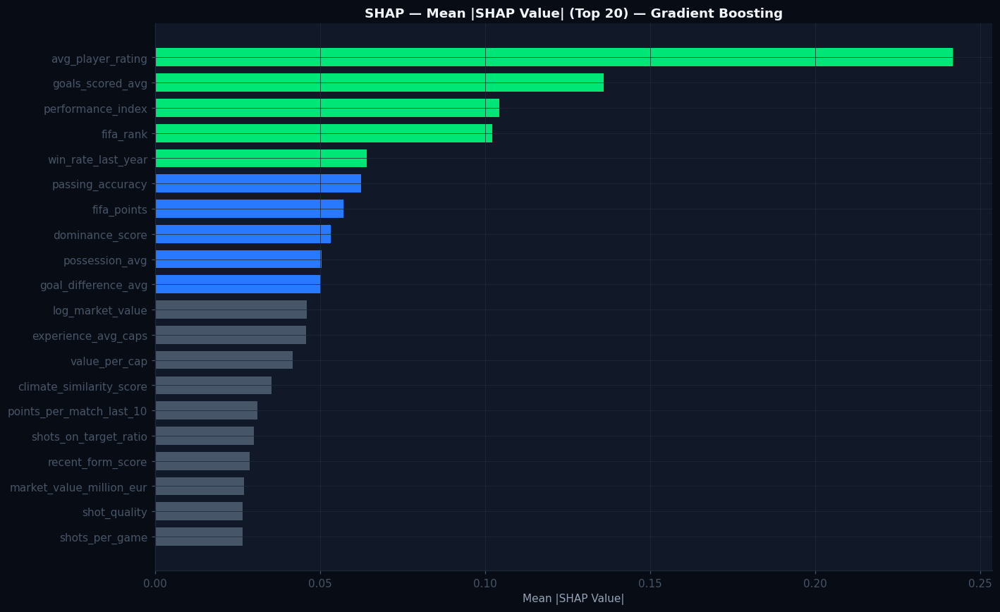<br/>
  <sub><b>SHAP Explainability</b> — global explanation view showing how features push predictions toward win or non-win.</sub>
</td>
</tr>
</table>

---

## 📊 Dataset Overview

### Raw dataset

| File | Rows | Purpose |
|---|---:|---|
| `data/raw/fifa_matches_train.csv` | 1,000 | Training data with target variable |
| `data/raw/fifa_matches_test.csv` | 250 | Test data for prediction/submission |
| `data/raw/sample_submission.csv` | Available | Submission format reference |

### Processed dataset

| File | Rows | Purpose |
|---|---:|---|
| `data/processed/cleaned_train.csv` | 1,000 | Cleaned + engineered training data |
| `data/processed/cleaned_test.csv` | 250 | Cleaned + engineered test data |
| `data/processed/submission.csv` | Generated | Predicted output file |

### Raw features

The dataset contains football team-level features across ranking, squad quality, tactical performance, recent form, and environmental conditions.

| Category | Example Features |
|---|---|
| Team Identity | `team_name`, `country_code`, `confederation` |
| Ranking Strength | `fifa_rank`, `fifa_points` |
| Recent Results | `wins_last_10_matches`, `losses_last_10_matches`, `draws_last_10_matches`, `win_rate_last_year` |
| Attack | `goals_scored_avg`, `shots_per_game`, `shots_on_target_ratio` |
| Defence | `goals_conceded_avg`, `clean_sheets_last_10` |
| Squad Quality | `avg_player_rating`, `star_players_count`, `market_value_million_eur`, `experience_avg_caps` |
| Management | `coach_experience_years` |
| Tactical Style | `possession_avg`, `passing_accuracy`, `recent_form_score` |
| Match Context | `host_advantage`, `travel_distance_avg`, `climate_similarity_score` |
| Target | `winner` |

---

## 🔁 End-to-End Workflow

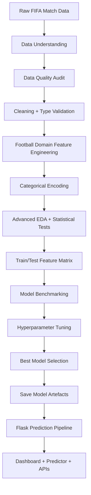

---

## 🧹 Data Cleaning Strategy

The cleaning workflow is implemented inside:

```text
src/data_preprocessing.py
```

### Cleaning steps

| Step | Description |
|---|---|
| Load raw data | Reads train/test CSV files from `data/raw/` |
| Standardise columns | Ensures consistent snake_case style naming |
| Validate schema | Checks required football features and target availability |
| Feature construction | Adds derived football intelligence indicators |
| Categorical encoding | Converts confederation and rank tier into model-ready columns |
| Train/test separation | Preserves target only for training data |
| Save processed output | Writes cleaned files to `data/processed/` |

### Why this matters

Clean preprocessing is important because the model is deployed in Flask. The same transformation logic must work both during training and during real-time prediction. ScoutIQ keeps preprocessing modular so that training and inference remain consistent.

---

## 🧠 Feature Engineering

Feature engineering is one of the strongest parts of this project. Instead of relying only on raw columns, ScoutIQ creates football-specific indicators that better represent team strength and match context.

| Engineered Feature | Formula / Logic | Football Interpretation |
|---|---|---|
| `points_per_match_last_10` | `(wins × 3 + draws) / last_10_games` | Converts recent match results into real football points logic |
| `goal_difference_avg` | `goals_scored_avg - goals_conceded_avg` | Net attacking and defensive strength |
| `performance_index` | `rating × 0.35 + form × 3.5 + win_rate × 10` | Composite team quality score |
| `value_per_cap` | `market_value / experience_avg_caps` | Market value efficiency relative to squad experience |
| `dominance_score` | `(possession + passing_accuracy) / 2` | Technical control and ball dominance |
| `shot_quality` | `shots_on_target_ratio × shots_per_game` | Shooting volume adjusted by accuracy |
| `defensive_solidity` | `clean_sheets_last_10 / 10` | Normalised defensive reliability |
| `log_market_value` | `log(1 + market_value)` | Reduces skew in high-value squad market values |
| `rank_tier` | FIFA rank bucket | Elite, Strong, Mid, Developing segmentation |
| Confederation dummies | One-hot encoding | Region-level football context |

### Final feature count

```text
40 model-ready features
```

The final model features are saved in:

```text
models/feature_columns.json
```

---

## 🔎 Exploratory Data Analysis

The EDA is split into professional notebooks for clarity and storytelling.

### Notebook 01 — Data Understanding and Cleaning

```text
notebooks/01_Data_Understanding_and_Cleaning.ipynb
```

Covers:

- Dataset loading
- Shape and column inspection
- Data quality checks
- Missing value analysis
- Duplicate detection
- Target variable review
- Feature engineering validation
- Processed dataset export

### Notebook 02 — Advanced EDA and Football Intelligence

```text
notebooks/02_Professional_EDA_and_Insights.ipynb
```

Covers:

- Executive KPI dashboard
- Distribution analysis
- Normality tests
- Correlation analysis
- Confederation deep-dive
- Market value and transfer intelligence
- Multi-method outlier detection
- Pairwise feature interactions
- PCA dimensionality reduction
- Statistical hypothesis testing
- Engineered feature validation
- Final insight summary

### Notebook 03 — Model Development and Evaluation

```text
notebooks/03_Model_Development_and_Evaluation.ipynb
```

Covers:

- Train matrix preparation
- Baseline benchmarking
- Cross-validation
- Hyperparameter tuning
- Ensemble experimentation
- Final model comparison
- Learning curves
- Explainability
- Artefact saving
- Submission generation


### Representative notebook outputs

The repository includes rich notebook visuals so visitors can immediately see the depth of analysis without opening Jupyter locally.

<p align="center">
  
</p>

<p align="center"><sub><b>Executive KPI Board</b> — a high-level summary dashboard exported from <code>02_Professional_EDA_and_Insights.ipynb</code>.</sub></p>

<table>
<tr>
<td width="50%" align="center">
  <br/>
  <sub><b>Correlation structure</b> across numeric variables and the target.</sub>
</td>
<td width="50%" align="center">
  <br/>
  <sub><b>Confederation intelligence</b> for tactical and performance benchmarking.</sub>
</td>
</tr>
<tr>
<td width="50%" align="center">
  <br/>
  <sub><b>Quadrant analysis</b> for scouting-style segmentation.</sub>
</td>
<td width="50%" align="center">
  <br/>
  <sub><b>PCA view</b> for multivariate pattern discovery.</sub>
</td>
</tr>
</table>

---

## 🤖 Machine Learning Pipeline

Model training is implemented inside:

```text
src/model_training.py
```

Prediction/inference is implemented inside:

```text
src/prediction_pipeline.py
```

### Pipeline design

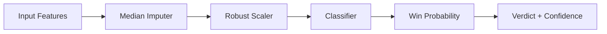

### Why RobustScaler?

Football data can include skewed values, especially market value, travel distance, player rating distribution, and ranking-related indicators. `RobustScaler` helps reduce sensitivity to outliers by scaling around median and interquartile range.

### Models benchmarked

| Model | Purpose |
|---|---|
| Logistic Regression | Strong interpretable baseline and final selected model |
| Random Forest | Non-linear ensemble baseline |
| Extra Trees | High-variance tree ensemble benchmark |
| Gradient Boosting | Sequential boosting baseline |
| XGBoost | Advanced gradient boosting benchmark |
| LightGBM | Fast gradient boosting benchmark |

---

## 🏆 Model Results

The final saved metadata is stored in:

```text
models/model_metadata.json
```

### Final selected model

| Property | Value |
|---|---:|
| Best Model | Logistic Regression |
| Problem Type | Binary Classification |
| Target Variable | `winner` |
| Dataset Size | 1,000 rows |
| Number of Features | 40 |
| CV ROC-AUC | `0.7161` |
| Train ROC-AUC | `0.7391` |
| Train Accuracy | `0.6680` |
| Train F1-score | `0.6376` |
| Train Log Loss | `0.6008` |

### Best hyperparameters

```python
{
    "solver": "saga",
    "penalty": "l2",
    "class_weight": None,
    "C": 0.1
}
```

### Model comparison table

| Rank | Model | CV AUC | Train AUC | Train Accuracy | Train F1 | MCC | Brier |
|---:|---|---:|---:|---:|---:|---:|---:|
| 1 | Logistic Regression | **0.7161** | 0.7391 | 0.6680 | 0.6376 | 0.3325 | 0.2067 |
| 2 | XGBoost | 0.7045 | 0.8427 | 0.7710 | 0.7470 | 0.5405 | 0.1738 |
| 3 | Extra Trees | 0.7021 | 1.0000 | 1.0000 | 1.0000 | 1.0000 | 0.0057 |
| 4 | Gradient Boosting | 0.6975 | 0.9539 | 0.8690 | 0.8590 | 0.7372 | 0.1290 |
| 5 | Random Forest | 0.6952 | 0.9999 | 0.9940 | 0.9936 | 0.9880 | 0.0654 |
| 6 | LightGBM | 0.6827 | 0.9167 | 0.8210 | 0.8069 | 0.6407 | 0.1474 |

### Model interpretation

Although tree-based models achieved higher training scores, their train metrics suggest possible overfitting. Logistic Regression produced the strongest cross-validated ROC-AUC and more controlled generalisation, which makes it a suitable choice for a production-style probability predictor.


### Model evaluation visuals

<p align="center">
  
</p>
<p align="center"><sub><b>Baseline Benchmarking</b> — first-pass model comparison under 5-fold cross-validation.</sub></p>

<table>
<tr>
<td width="50%" align="center">
  <br/>
  <sub><b>Hyperparameter tuning gains</b> across shortlisted models.</sub>
</td>
<td width="50%" align="center">
  <br/>
  <sub><b>Model performance heatmap</b> for compact multi-metric comparison.</sub>
</td>
</tr>
<tr>
<td width="50%" align="center">
  <br/>
  <sub><b>ROC / PR / Calibration</b> — measures ranking quality, class precision-recall, and probability calibration.</sub>
</td>
<td width="50%" align="center">
  <br/>
  <sub><b>Feature importance dashboard</b> showing the strongest football performance drivers.</sub>
</td>
</tr>
</table>

<p align="center">
  
</p>
<p align="center"><sub><b>SHAP Explainability Summary</b> — global interpretation view used to communicate model reasoning more clearly.</sub></p>

---

## 🧩 Saved Artefacts

| File | Purpose |
|---|---|
| `models/best_model.pkl` | Final trained sklearn pipeline |
| `models/feature_columns.json` | Ordered feature list required for inference |
| `models/model_metadata.json` | Model name, metrics, hyperparameters, comparison summary |
| `models/model_comparison.csv` | Model leaderboard table |
| `data/processed/submission.csv` | Generated prediction submission file |

---

## 🏗️ Application Architecture

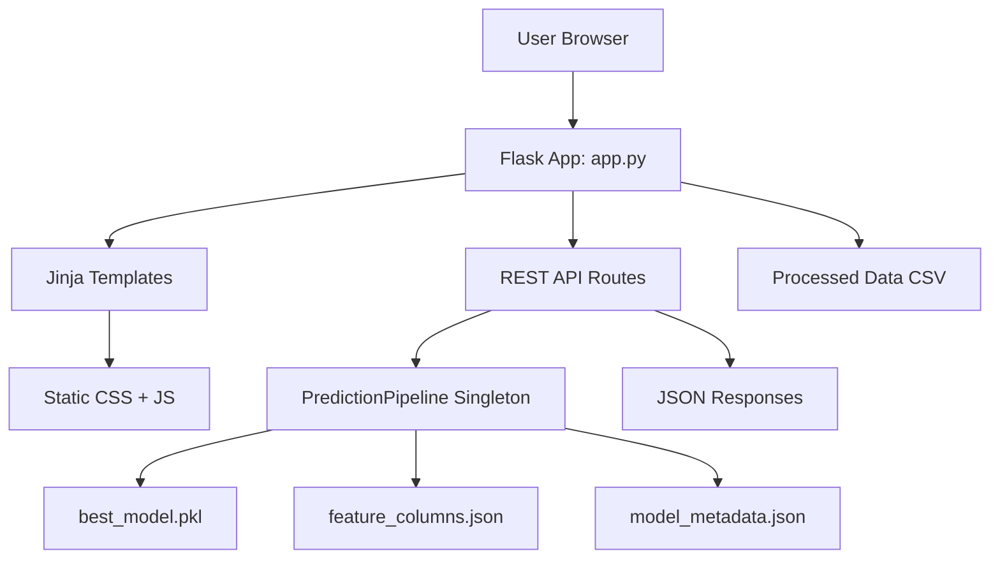

### Backend responsibilities

| Component | Responsibility |
|---|---|
| `app.py` | Flask routes, UI rendering, API endpoints, error handlers |
| `src/data_preprocessing.py` | Data loading, cleaning, encoding, derived features |
| `src/feature_engineering.py` | Feature list creation and sklearn pipeline helpers |
| `src/model_training.py` | Training, tuning, evaluation, artefact saving |
| `src/prediction_pipeline.py` | Model loading and real-time prediction logic |
| `src/utils.py` | KPI formatting, dashboard helpers, summary calculations |

### Frontend responsibilities

| Component | Responsibility |
|---|---|
| `templates/` | Jinja HTML pages |
| `static/css/style.css` | Premium dark sports analytics styling |
| `static/js/dashboard.js` | Dashboard interactivity and API rendering |

---

## 🌐 Flask Pages

### 1. Home Page

```text
/
```

A premium landing page introducing ScoutIQ as a football intelligence and machine learning platform.

### 2. Dashboard

```text
/dashboard
```

Displays executive football KPIs, team summaries, and insight cards.

### 3. Team Explorer

```text
/explorer
```

Allows users to browse team records and inspect football metrics.

### 4. ML Predictor

```text
/predict
```

Accepts team-level inputs and returns predicted win probability, verdict, confidence, and loss probability.

### 5. Compare Teams

```text
/compare
```

Compares two teams using the project’s processed dataset and football metrics.

### 6. Model Intelligence

```text
/model-insights
```

Shows final model metrics, model comparison, metadata, and explainability narrative.

### 7. About Page

```text
/about
```

Explains the end-to-end data science lifecycle and project story.

---

## 🔌 REST API Documentation

ScoutIQ includes API endpoints that make the app usable beyond the browser UI.

### Dashboard data

```http
GET /api/dashboard-data
```

Returns data required for dashboard visualisations and executive KPI cards.

### Team explorer data

```http
GET /api/players
```

Returns team/player-style records for the explorer page.

### Predict win probability

```http
POST /api/predict
Content-Type: application/json
```

Example request:

```json
{
  "team_name": "Brazil",
  "country_code": "BRA",
  "confederation": "CONMEBOL",
  "fifa_rank": 8,
  "fifa_points": 1831.2,
  "wins_last_10_matches": 7,
  "losses_last_10_matches": 2,
  "draws_last_10_matches": 1,
  "win_rate_last_year": 0.69,
  "goals_scored_avg": 2.31,
  "goals_conceded_avg": 0.76,
  "clean_sheets_last_10": 5,
  "shots_per_game": 19.2,
  "shots_on_target_ratio": 0.502,
  "avg_player_rating": 86.2,
  "star_players_count": 4,
  "market_value_million_eur": 1174.0,
  "experience_avg_caps": 53,
  "coach_experience_years": 25,
  "recent_form_score": 8.2,
  "possession_avg": 55.2,
  "passing_accuracy": 87.4,
  "host_advantage": 0,
  "travel_distance_avg": 6.7,
  "climate_similarity_score": 0.70
}
```

Example response:

```json
{
  "probability": 0.7345,
  "probability_pct": 73.5,
  "loss_probability_pct": 26.5,
  "verdict": "High Win Probability",
  "confidence": "Strong",
  "color": "#22c55e"
}
```

### Compare teams

```http
GET /api/compare?team1=Brazil&team2=France
```

Returns team-level comparison metrics used by the comparison page.

---

## 📁 Project Structure

```text
ScoutIQ/
├── app.py
├── Procfile
├── README.md
├── requirements.txt
├── runtime.txt
├── .gitignore
│
├── data/
│   ├── raw/
│   │   ├── fifa_matches_train.csv
│   │   ├── fifa_matches_test.csv
│   │   └── sample_submission.csv
│   │
│   └── processed/
│       ├── cleaned_train.csv
│       ├── cleaned_test.csv
│       └── submission.csv
│
├── models/
│   ├── best_model.pkl
│   ├── feature_columns.json
│   ├── model_comparison.csv
│   └── model_metadata.json
│
├── notebooks/
│   ├── 01_Data_Understanding_and_Cleaning.ipynb
│   ├── 02_Professional_EDA_and_Insights.ipynb
│   └── 03_Model_Development_and_Evaluation.ipynb
│
├── src/
│   ├── data_preprocessing.py
│   ├── feature_engineering.py
│   ├── model_training.py
│   ├── prediction_pipeline.py
│   └── utils.py
│
├── static/
│   ├── css/
│   │   └── style.css
│   ├── js/
│   │   └── dashboard.js
│   ├── charts/
│   └── images/
│
└── templates/
    ├── base.html
    ├── index.html
    ├── dashboard.html
    ├── explorer.html
    ├── predictor.html
    ├── compare.html
    ├── model_insights.html
    └── about.html
```

---

## ⚙️ Installation Guide

### 1. Clone the repository

```bash
git clone https://github.com/your-username/ScoutIQ.git
cd ScoutIQ
```

### 2. Create a virtual environment

#### Windows

```bash
python -m venv venv
venv\Scripts\activate
```

#### macOS / Linux

```bash
python3 -m venv venv
source venv/bin/activate
```

### 3. Install dependencies

```bash
pip install --upgrade pip
pip install -r requirements.txt
```

### 4. Train or refresh the model

```bash
python src/model_training.py
```

This will generate or update:

```text
models/best_model.pkl
models/feature_columns.json
models/model_metadata.json
models/model_comparison.csv
```

### 5. Run the Flask app

```bash
python app.py
```

Open the app in your browser:

```text
http://127.0.0.1:5000
```

---

## 📓 How to Run Notebooks

Install Jupyter if needed:

```bash
pip install notebook ipykernel
```

Start Jupyter:

```bash
jupyter notebook
```

Recommended notebook order:

```text
1. notebooks/01_Data_Understanding_and_Cleaning.ipynb
2. notebooks/02_Professional_EDA_and_Insights.ipynb
3. notebooks/03_Model_Development_and_Evaluation.ipynb
```

This order follows the real data science workflow from raw data to final model artefacts.

---

## ☁️ Deployment Guide

ScoutIQ already includes deployment files:

| File | Purpose |
|---|---|
| `Procfile` | Defines production start command |
| `runtime.txt` | Python runtime version |
| `requirements.txt` | Required dependencies |
| `gunicorn` | Production WSGI server |

### Render deployment

1. Push the project to GitHub.
2. Create a new **Web Service** on Render.
3. Connect your GitHub repository.
4. Use the following commands:

```bash
Build Command: pip install -r requirements.txt
Start Command: gunicorn app:app --workers 2 --timeout 120
```

5. Deploy the service.

### Heroku-style deployment

```bash
git add .
git commit -m "Deploy ScoutIQ football intelligence platform"
git push heroku main
```

---

## 🔁 Reproducibility

The project keeps reproducibility in mind through:

- Fixed random states in model training
- Saved feature ordering in `feature_columns.json`
- Model metadata saved as JSON
- Processed datasets stored separately from raw data
- Modular training and prediction files
- Standard `requirements.txt` dependency management

Recommended workflow for a fresh run:

```bash
python src/model_training.py
python app.py
```

---

## 🧪 Quality Checks

Before pushing to GitHub, verify:

```bash
python src/model_training.py
python app.py
```

Then test these routes manually:

```text
/
/dashboard
/explorer
/predict
/compare
/model-insights
/about
/api/dashboard-data
/api/players
```

---

## 🧭 Future Improvements

Planned improvements that can make ScoutIQ even stronger:

- [ ] Add SHAP explainability plots for individual predictions
- [ ] Add calibration curve and probability reliability dashboard
- [ ] Add player-level scouting dataset integration
- [ ] Add historical match timeline analytics
- [ ] Add Elo rating features
- [ ] Add injury/suspension context features
- [ ] Add automated model retraining pipeline
- [ ] Add Dockerfile for containerised deployment
- [ ] Add unit tests for preprocessing and prediction pipeline
- [ ] Add CI/CD workflow using GitHub Actions
- [ ] Add live hosted demo link
- [ ] Add screenshots or GIF demo in `static/images/`

---

## 🧠 Skills Demonstrated

| Skill Area | Tools / Concepts |
|---|---|
| Programming | Python, modular scripts, reusable functions |
| Data Analysis | Pandas, NumPy, statistical summaries, EDA |
| Visual Analytics | Plotly, Matplotlib, dashboard storytelling |
| Machine Learning | scikit-learn, XGBoost, LightGBM, cross-validation |
| Model Evaluation | ROC-AUC, Accuracy, F1, MCC, Brier score, log loss |
| Feature Engineering | Football domain features, rank tiers, encoding |
| Backend | Flask, Jinja templates, REST APIs |
| Deployment | Gunicorn, Procfile, runtime config |
| Product Design | Dashboard, explorer, predictor, comparison page |

---

## 👤 Author

<div align="center">

<h3>Akshay Rathod</h3>

<p>
Data Science • Machine Learning • AI/ML Engineering • Analytics Projects
</p>

<a href="mailto:akshayrathod8179@gmail.com">
  
</a>
<a href="https://github.com/Akshay8087">
  
</a>
<a href="https://www.linkedin.com/">
  
</a>

</div>

---

## ⭐ Final Note

ScoutIQ is built as a complete portfolio-grade project: it starts with raw football data, builds meaningful football intelligence features, benchmarks machine learning models, saves production artefacts, and serves predictions through a polished Flask web application.

If this project helped you understand football analytics, machine learning deployment, or data science portfolio building, consider giving it a ⭐ on GitHub.

<div align="center">


</div>
